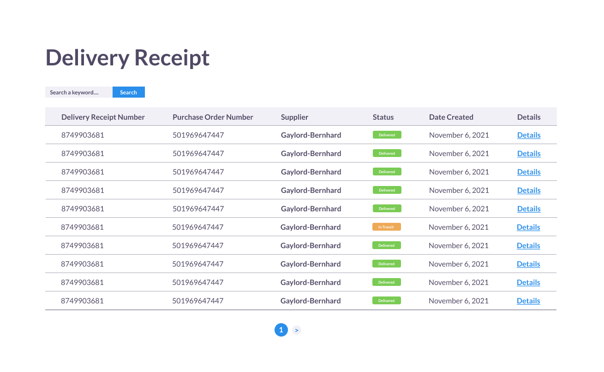
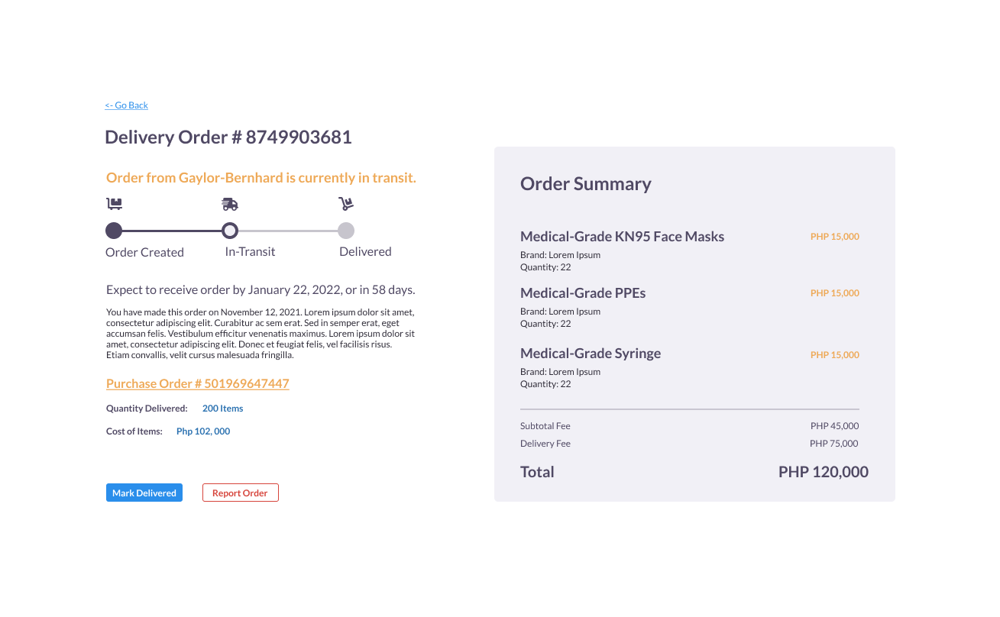

<div id="top"></div>

<h2 align="center">ProjectX</h2>
<p align="center">
A responsive Delivery Receipt table demonstration for InterLeukin.
    <br />
    <a href="https://github.com/kennethtegrado/projectx"><strong>Explore the docs »</strong></a>
    <br />
    <br />
    <a href="https://interleukin-projectx.vercel.app/">View Demo</a>
    ·
    <a href="https://github.com/kennethtegrado/projectx/issues">Create an Issue</a>
    <br />
    <br />
    <strong>Made by <a href="https://github.com/kennethtegrado">@kennethtegrado</a></strong>
</p>

<details>
<summary>Table of Contents</summary>
    <ol>
         <li>
            <a href="#comments">Comments</a>
        </li>
        <li>
            <a href="#getting-started">Getting Started</a>
            <ol>
                <li>
                      <a href="#prerequisites">Prerequisites</a>
                </li>
                <li>
                      <a href="#built-with">Built With</a>
                </li>
                <li>
                      <a href="#installation">Installation</a>
                </li>
            </ol>
        </li>
        <li>
            <a href="#project-specifications">Project Specifications</a>
            <ol>
                <li>
                      <a href="#folder-structure">Folder Structure</a>
                </li>
                <li>
                      <a href="#folder-description">Folder Description</a>
                </li>
            </ol>
        </li>
    </ol>
</details>

## Comments

-   A table with too many columns indicating too many information may be overwhelming for users. To fix this issue, information presented should not exceed ten columns and should only be those that needs emphasis and can be searched with a keyword. Developers should create a new page for the application that can be used to present other information, mimicking a real receipt.
    

    -   The goal of the improvement above is to only show to the medical facilities whether the order have already arrived. If the customer wants to look for more information, they should click the details link.

-   Create a specific page to feature delivery receipts. This page shall contain all the necessery details about their order.
    
    -   This change ensures that people working with the table will only see the whole details about the delivery receipt if that is their intention. Too much information on the get-go is bad for users who are skimming and looking for specific information about their purchases.

> These comments aim to improve the user experience of people using the Delivery Receipt.

## Getting Started

### Prerequisites

Ensure that you have node installed on your local machine.

```bash
node -v
    v16.13.2
npm -v
    8.11.0
```

This project won't work when your version of node is below v14.8. Ensure that you have the latest version of node installed.

### Built with

-   [![React][react.js]][react-url]
-   [![TypeScript][typescript]][typescript-url]
-   [![Vite][vite.js]][vite-url]

<!-- Markdown links -->

[react.js]: https://img.shields.io/badge/React-20232A?style=for-the-badge&logo=react&logoColor=61DAFB
[typescript]: https://img.shields.io/badge/TypeScript-3178C6?style=for-the-badge&logo=typescript&logoColor=white
[vite.js]: https://img.shields.io/badge/Vite-9863f9?style=for-the-badge&logo=vite&logoColor=fbc925
[react-url]: https://reactjs.org/
[typescript-url]: https://www.typescriptlang.org/docs/handbook/intro.html
[vite-url]: https://vitejs.dev/

### Installation

1. Go to a directory where you want to copy the project to your local machine.
2. Open a terminal inside that directory and run the commands below:

    ```bash
    git clone https://github.com/kennethtegrado/projectx

    cd projectx
    ```

3. Install the project's packages to your machine by running the command below:
    ```bash
    npm install
    ```
4. Run the project inside your machine by running the command below:
    ```bash
    npm run dev
    ```
5. Open a browser and visit http://127.0.0.1:5173/ to view local deployment.

## Project Specifications

### Folder Structure

All of the project's files are concentrated inside the src folder, so you should only focus on that.

```
- assets
- components
    - layout
    - pages
    - project-ui
    - ui
- data
- interfaces
- utils
    - data
    - hoc
```

### Folder Description

| Name                  | Description                                                                                          |
| --------------------- | ---------------------------------------------------------------------------------------------------- |
| assets                | Folder for static files that will be served to the client through JavaScript.                        |
| components            | Folder for React components that make up the application.                                            |
| components/layout     | Folder for layout components.                                                                        |
| components/pages      | Folder for page components that represents a route inside the application                            |
| components/project-ui | Folder for compound components that are specifically built for the project                           |
| components/ui         | Folder for atomic components that are stateless and should only be controlled by a parent component. |
| data                  | Folder for the fake database that can be used to test the functionality of the application           |
| interfaces            | Folder for typescript interfaces that will be used throughout the whole application                  |
| utils                 | Folder for helper functions.                                                                         |
| utils/data            | Folder for helper functions built specifically to process data.                                      |
| utils/hoc             | Folder for higher order components that passes cross-cutting states to different applications        |
